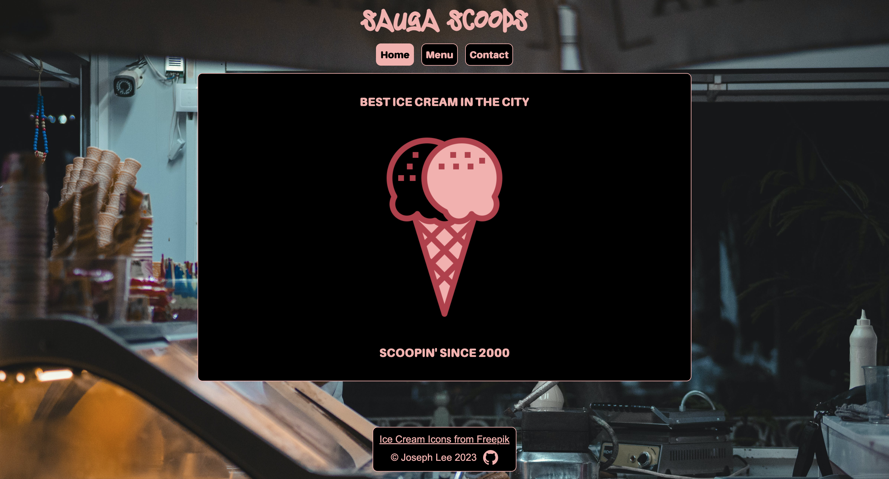

# Sauga Scoops

My implementation of the [restaurant page project](https://www.theodinproject.com/lessons/node-path-javascript-restaurant-page) for [The Odin Project](https://www.theodinproject.com/). Try it [here](https://jooo-lee.github.io/sauga-scoops/)!

## Description:

This is a business website for an imaginary ice cream shop called Sauga Scoops.

## I learned how to:

-   Install dependencies using npm
-   Write and run npm scripts
-   Bundle code and assets using webpack
-   Write JavaScript code in a modular fashion using ES6 modules
-   Dynamically render the contents of a website using JavaScript

## Acknowledgements:

[Title font](https://fontmeme.com/fuentes/fuente-ending-loving/) from [Font Meme](https://fontmeme.com/).

[Body font](https://fontmeme.com/fonts/amiamie-round-font/) from [Font Meme](https://fontmeme.com/).

[Background image](https://www.pexels.com/photo/a-man-working-at-an-ice-cream-shop-18003564/) from [Pexels](https://www.pexels.com/).

[Ice cream icons](https://www.freepik.com/author/surang/icons/surang-red_752?t=f&query=ice%20cream%20surang%20red) from [Freepik](https://www.freepik.com/).
